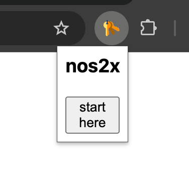
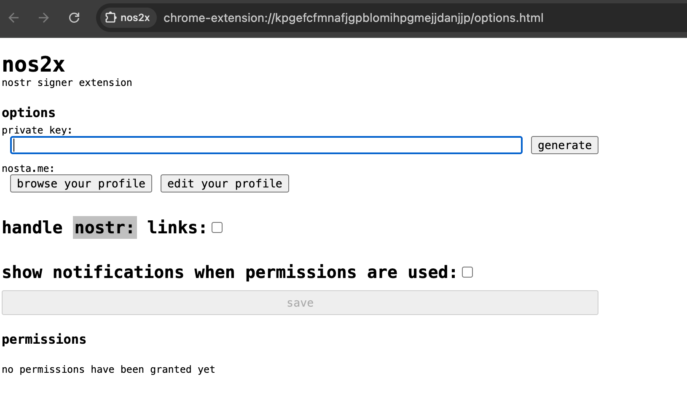
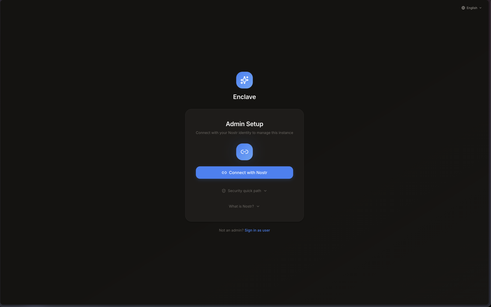
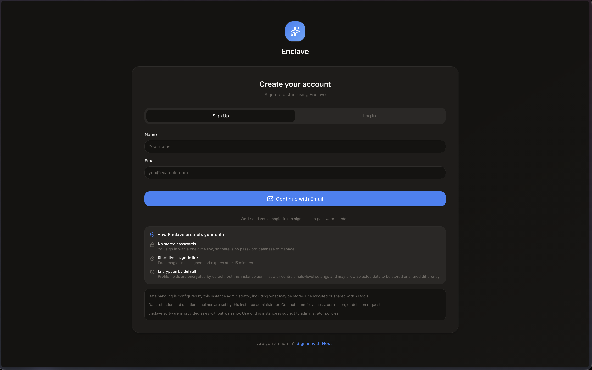
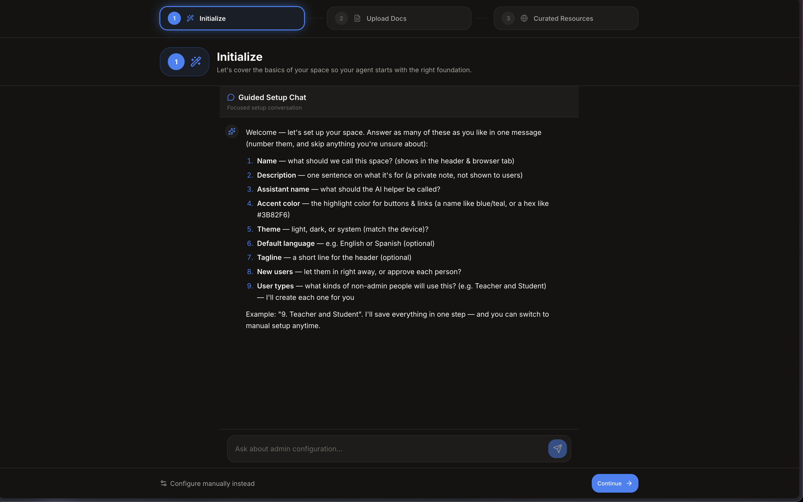
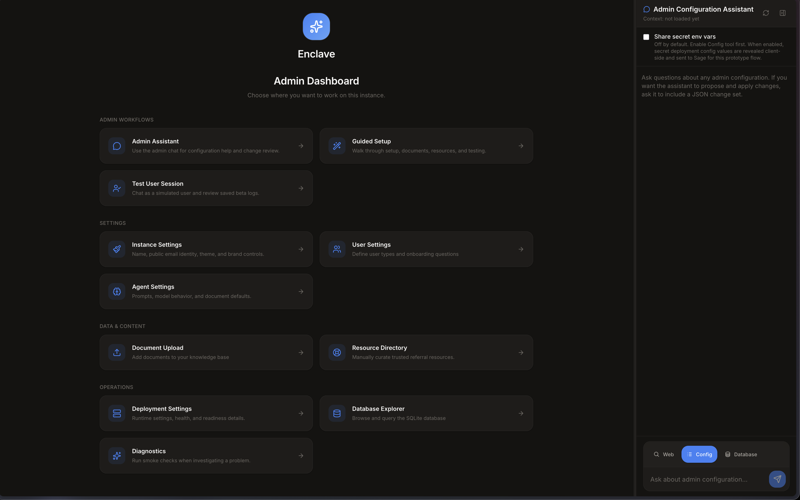

# Enclave Demo Deployment Handoff

This is the simple path for taking over and trying the demo instance.

You should receive two things separately:

- Demo URL: `https://demo.enclave.free`
- Admin Nostr key: sent privately, not in this document

Keep the admin Nostr key private. Do not paste it into Enclave chat, the admin assistant, email, or support threads.

## Fast Path

1. Put the admin Nostr key into a NIP-07 signer, such as nos2x.
2. Sign in as admin at `https://demo.enclave.free/admin`.
3. Open **Guided Setup**.
4. Answer the onboarding questions.
5. Upload a few initial documents.
6. Add a few curated resources.
7. Test as a user.
8. Approve any new users from **User Settings**.
9. Ask the admin agent to configure anything else you need.

## 1. Admin Sign-In

Admins use the Nostr key.

1. Install or open a NIP-07 signer, such as nos2x, Alby, or another Nostr browser extension.
2. Import the admin Nostr key you were given.
3. Open `https://demo.enclave.free/admin`.
4. Click **Connect with Nostr**.
5. Approve the signature request in the signer.

The private key stays in the signer. Enclave only asks the signer to approve the admin login.

Use the exact admin key you were given. A different Nostr key will not have admin access.

If you are using nos2x:

Click the nos2x extension icon. If it shows **start here**, click it.

On the nos2x options page, paste the admin Nostr key into **private key**, save it, then return to `https://demo.enclave.free/admin` and click **Connect with Nostr**.

Do not click **generate** for this demo. Use the admin key you were given.







## 2. User Sign-In

Users do not need Nostr.

Users sign up or log in with email:

1. Open `https://demo.enclave.free`.
2. Choose the user sign-up or login flow.
3. Enter a name and email.
4. Click **Continue with Email**.
5. Open the magic link email and click the link.

Email is already set up for this demo, so you can create a real test user yourself.

Important: new users currently need to be verified one by one before they can use chat. After a user signs up, approve them from **Admin Dashboard -> User Settings**.



## 3. First Setup

After admin sign-in, open **Guided Setup** from the admin dashboard.

Use the onboarding chat to get the instance into a useful starting state:

1. Answer the onboarding questions in plain language.
2. Upload a few initial documents, such as PDFs, guides, policies, FAQs, or other reference material.
3. Add a few curated resources, such as trusted links, contacts, referrals, or services.

You can answer the setup chat in one message. Keep it simple:

```text
Name:
What this instance is for:
Assistant name:
User types:
What new users should be asked:
Any important rules or tone:
```

When Enclave proposes changes, review them and click **Apply** if they look right.



## 4. Admin Dashboard And Agent

The admin dashboard is where you manage the instance.

The main thing to know: you can ask the admin agent to configure or set things up at any time.

Good things to ask:

```text
What still needs setup before this demo is ready?
```

```text
Create onboarding questions for new users.
```

```text
Set up user types for Staff and Member.
```

```text
Show me which documents and resources are currently configured.
```

```text
Change the assistant name and default tone.
```

The agent should show a change review before applying configuration changes. Read the review, then click **Apply** only if it matches what you want.

You can also test from the admin side:

- **Test User Session** lets you simulate a user chat without leaving the admin dashboard.
- You can also sign up as a real user with email and go through the magic link flow.

Leave **Share secret env vars** off unless you are intentionally debugging deployment settings.



## Speed And Chat Sessions

The AI model may feel a little slower than we want right now. For this demo, we are choosing intelligence over speed.

Start new chats often, especially when doing admin configuration. Fresh chats are usually faster, easier to follow, and cheaper in AI tokens.

## Tiny Troubleshooting

- Admin sign-in fails: confirm the signer has the exact admin Nostr key for this instance.
- No Nostr prompt appears: unlock the signer, refresh the page, and click **Connect with Nostr** again.
- User cannot chat yet: approve the user in **Admin Dashboard -> User Settings**.
- Magic link does not arrive: check spam, then ask an admin to check **Deployment Settings**.

That is enough for a first demo. Everything else can be refined from the admin dashboard.
